# Decision pipeline

Referenced by `/mnt/dietpi_userdata/staging/pi-trading/CLAUDE.md`. Keep this in sync with any behavior change to `_run_portfolio_iteration` or `_run_crypto_iteration`. Portfolio mode is the only equity mode: `initialize()` sets `sleeptime = "10M"` — a cheap poll, not the evaluation cadence itself — and `on_trading_iteration` calls `_due_iteration_window_now()` first: it returns `None` (skip, cost-free) on most polls and only the label `"open"` or `"midday"` when that window's time has arrived, gated by `_due_portfolio_iteration_window` (pure/tested in `tests/test_safety.py`) against `.portfolio_iteration_state.json` (today's `windows_completed`, restart-safe, reset when the calendar date rolls over). Net effect: the equity pipeline below runs at most twice a trading day, at market open and `PORTFOLIO_SECOND_ITERATION_OFFSET_MINUTES` (default 210) after it. Crypto runs on a separate, much simpler cadence — see its own section below.

## Equity: `AssetRotationStrategy._run_portfolio_iteration` (strategy.py)

Called from `on_trading_iteration` once a due window fires. Phase order:

1. **Universe** — `_managed_portfolio_symbols()` (static `PORTFOLIO_SYMBOLS` ∪ discovery-confirmed owned symbols) → `_portfolio_held_positions()` (broker read, filtered to `asset_type in ("stock", "us_equity")`; a read failure aborts the iteration — an empty dict would look like an empty portfolio and trigger duplicate buys) → `_portfolio_symbols()` (managed ∪ held ∪ one autonomous-discovery batch, if `PORTFOLIO_AUTONOMOUS_DISCOVERY`).
2. **Market-level context** — `_get_news_context()`, `_symbol_news_scores()`, `_llm_assessment_for_iteration()` (may defer the advisory LLM call to after trading — see fail-safes below), `_defer_or_run_discovery_analysis()`, `_update_adaptive_learning()` / `_update_llm_adaptive_learning()`, `_market_veto_reason()` (world-event/LLM/learned-model block check — blocks **new** purchases/replacements only; completing an in-flight replacement or exit is never vetoed). `_refresh_symbol_reference()` and `_load_nightly_preeval_learnings()` (surfaces last night's overnight pass — see "Off-hours side channel" below — into the email only, never gates anything) also run in this phase. `_check_discovery_red_flags` then screens only the symbols discovery itself just added this iteration (never held/static ones) with negative `_symbol_news_scores` coverage — logged/reported always, only actually dropped from `symbols` when `PORTFOLIO_DISCOVERY_LLM_BLOCK_ENABLED` is true (advisory-by-default). `_check_discovery_article_context` runs immediately after over the same candidates — purely advisory, never excludes a symbol.
3. **Opportunistic Opportunity** — `_opportunistic_opportunity(asset_a, asset_b, ...)` computes dip/forecast/probability via `TradeMemory`, evaluated exactly once as a single non-looped decision, before phase 6 gets to pick from `eligible`.
4. **Restart-safe rotation reconciliation** — `_reconcile_pending_portfolio_rotations(held)` completes or resets any sell-then-buy pair staged in a prior iteration/process life (`.portfolio_rotation_state.json`), before any new decision is made. Still holding the source with an active sell → wait. Dead sell (order died / lost across restart) → reset and re-evaluate. Sale done → buy the target (also continued immediately in `on_filled_order` when the sale fills). Returns `claimed_symbols`, the single source of truth preventing a symbol from being touched twice in one pass.
5. **Exits** — `_submit_due_portfolio_exits()` (take-profit/stop-loss against the broker's cost basis and the live bid, plus a holding-horizon backstop; a plain single-leg sell, never vetoed, skipping anything in `claimed_symbols`), `_queue_exit_narratives()` (one descriptive LLM sentence connecting a just-submitted exit to that symbol's own coverage, deferred; the sale itself already happened on price alone).
6. **Signals** — `_portfolio_signals(symbols)` (threaded per-symbol dip/edge computation via `_portfolio_signal`, measuring dips against the *previous* lookback bars excluding the event day's own high; also enforces a discovery liquidity floor — reject if price is below `PORTFOLIO_DISCOVERY_MIN_PRICE_DOLLARS` or recent average volume is below `PORTFOLIO_DISCOVERY_MIN_AVG_VOLUME` — applied to the whole evaluated universe, not just new discoveries), `_exclude_unpriceable_discovered_symbols()` (a discovery-only symbol with zero price history is permanently excluded via `AutonomousUniverse.exclude_unpriceable()`; a config-listed symbol never is), then per evaluated symbol: `_backfill_portfolio_memory()` + `_update_portfolio_memory()` (every evaluated symbol contributes a learning observation, not just qualifying ones — `signal_present` records whether today's dip actually cleared the live threshold) → `_posture_adjusted_edge()` (reshapes each candidate's raw historical edge through `PORTFOLIO_RISK_POSTURE`: `conservative`, default, penalizes return variance and a negative news-score day harder; `risky` barely discounts either) → eligibility filter (`qualifies`, min observations, `PORTFOLIO_MIN_EXPECTED_PROFIT_PERCENT`, out-of-sample floor — all computed from the raw `expected_profit`/`oos_expected_profit`, never shifted by posture or the learned edge) → sort.
7. **Opportunistic Opportunity execution** — if eligible (asset_a held & unclaimed, asset_b not held & unclaimed, forecast ready, dip/probability/edge thresholds met, not already swapped today): `_submit_portfolio_rotation_sell(asset_a, asset_b, ...)`, mark `opportunistic_swap_done` in `.portfolio_iteration_state.json` (survives a restart between the day's two windows — enforces at most one swap per day even though a trading day can call this function up to twice), update `held_working`/`claimed_symbols`.
8. **Build / replace / top-up** — `_submit_portfolio_builds()` (empty slots, ranked candidates, `_optimal_position_count()`-sized against today's total capital), `_submit_portfolio_replacements()` (swap a weak unclaimed holding for a materially stronger candidate — requires the target's posture-adjusted edge to beat the weakest holding by `PORTFOLIO_MIN_EXPECTED_PROFIT_PERCENT`), `_maybe_top_up_portfolio()` (residual cash into the best already-held candidate). All three loop over every remaining ranked candidate this iteration, not just the single best one, and are skipped entirely if `_market_veto_reason()` set a veto.
9. **Reporting** — `_summarize_portfolio_actions()`, then (in `on_trading_iteration`'s `finally`) `_record_memory_decision()`, `_generate_daily_narrative()` (a purely descriptive LLM recap, `report["daily_narrative"]`, shown at the top of the daily email), `_send_daily_email()`, and last `_start_deferred_llm_analysis()` (advisory-only; must never delay orders, state persistence, or the report).

### Diagram

```mermaid
flowchart TD
    Poll["Lumibot poll: every 10 minutes<br/>(self.sleeptime = '10M')"] --> Gate{"_due_iteration_window_now()<br/>is 'open' or 'midday' window due today?"}
    Gate -- "no (already run, before open, etc.)" --> Skip["Return: no evaluation this poll"]
    Gate -- "yes" --> Iter["on_trading_iteration()<br/>calls _run_portfolio_iteration(report)"]

    subgraph CTX[Context gathering]
        direction TB
        Managed["_managed_portfolio_symbols()<br/>static watchlist ∪ managed-discovered ∪ held ∪ pending-rotation"]
        Held["_portfolio_held_positions()<br/>broker cost basis + quantities"]
        HeldFail{"positions unavailable?"}
        Universe["_portfolio_symbols()<br/>managed ∪ held ∪ one discovery batch<br/>(mutates AutonomousUniverse's batch cursor)"]
        SymRef["_refresh_symbol_reference()<br/>(background thread)"]
        News["_get_news_context()<br/>Alpaca headlines (+ free RSS if enabled)<br/>+ keyword score"]
        SymScores["_symbol_news_scores()<br/>per-symbol cross-checked coverage"]
        LLM["_get_llm_news_assessment()<br/>Ollama market-wide risk read"]
        Nightly["_load_nightly_preeval_learnings()<br/>today's overnight verdict-cache summary, if any<br/>(surfaced in the report only, never gates anything)"]
    end
    Iter --> Managed --> Held --> HeldFail
    HeldFail -- yes --> Abort["status = 'positions unavailable', stop"]
    HeldFail -- no --> Universe --> SymRef --> News --> SymScores --> LLM --> Nightly

    subgraph SCREEN[Discovery screening & learning]
        direction TB
        RedFlags["_check_discovery_red_flags()<br/>discovery-only symbols with negative score<br/>advisory, or excludes if<br/>PORTFOLIO_DISCOVERY_LLM_BLOCK_ENABLED"]
        ArticleCtx["_check_discovery_article_context()<br/>same discovery-only symbols, live —<br/>cache hit if the nightly pass already<br/>covered them; advisory only, never excludes"]
        AdaptiveKw["_update_adaptive_learning()<br/>keyword score → next-session return"]
        AdaptiveLLM["_update_llm_adaptive_learning()<br/>LLM score → next-session return<br/>(observational only, not yet wired to the veto)"]
    end
    Nightly --> RedFlags --> ArticleCtx --> AdaptiveKw --> AdaptiveLLM

    AdaptiveLLM --> Veto{"_market_veto_reason()<br/>news score ≤ threshold?<br/>LLM score ≤ threshold?<br/>adaptive forecast ≤ threshold (correlation-gated)?"}

    subgraph EXEC[Trade execution phases — one pass can run several]
        direction TB
        P0["Phase 0: reconcile pending rotations<br/>(never vetoed — the sale already happened)"]
        P1["Phase 1: exits<br/>take-profit / stop-loss / holding-horizon<br/>(never vetoed, single-leg sell)"]
        Opportunity["_opportunistic_opportunity()<br/>A-vs-B win probability + edge<br/>(trade_memory.py regression)"]
        Rank["Rank eligible signals by<br/>posture-adjusted edge<br/>(_posture_adjusted_edge)"]
        P2["Phase 2: Opportunistic Opportunity swap<br/>Asset A → Asset B, at most once/day"]
        P3a["Phase 3a: build empty slots"]
        P3b["Phase 3b: replace weakest holding(s)"]
        P3c["Phase 3c: top up if nothing else fired"]
    end
    Veto --> P0 --> P1 --> Opportunity --> Rank --> VetoGate{"veto_reason set?"}
    VetoGate -- "yes — new exposure blocked" --> SkipTrades["Phase 2 and 3 skipped this pass"]
    VetoGate -- no --> P2 --> P3a --> P3b --> P3c

    subgraph FIN["Finalization — always runs, even after a caught error"]
        direction TB
        Memory["_record_memory_decision()<br/>portfolio_memory.py / trade_memory.py"]
        Narrative["_generate_daily_narrative()<br/>LLM 2-3 sentence recap, if enabled"]
        Email["_send_daily_email()<br/>at most one per calendar day"]
    end
    P3c --> Memory --> Narrative --> Email
    SkipTrades --> Memory
    Abort --> Memory
```

### Off-hours side channel: the nightly pre-evaluation pass

`scripts/nightly_preeval.py`, run once at 03:00 ET by
`trading-agent-nightly-preeval.timer`, calls `_run_nightly_preevaluation` — a
separate process, a separate strategy instance, entirely outside the diagram
above. It reads `_managed_portfolio_symbols()` (read-only) ∪ currently-held
positions — deliberately **not** `_portfolio_symbols`, which calls
`AutonomousUniverse.next_batch()` and would consume a discovery batch the
live morning iteration should get instead — fetches a fresh `NewsContext`,
and calls `_check_discovery_article_context(..., require_negative_score=False)`
over every one of those symbols (not just discovery's negative-news ones, as
the live call below still does by default), populating
`.article_verdicts.duckdb`'s same-day cache. It persists a summary to
`.nightly_preeval_state.json`, which `_load_nightly_preeval_learnings` reads
back into the live report's "Learned at night" email line — informational
only, it cannot itself gate a trade. The point is cache warmth, not a new
signal: when the live pipeline's own `_check_discovery_article_context` step
reaches a symbol the nightly pass already checked, `article_filter.extract_financial_context`'s
cache lookup hits and skips the Ollama round-trip.

## Crypto: `CryptoRotationStrategy._run_crypto_iteration` (crypto_strategy.py)

Called from `on_trading_iteration` every `sleeptime` tick (`CRYPTO_ITERATION_INTERVAL_MINUTES`), gated by `market_sessions.nyse_is_open` — no-ops whenever NYSE is open, and whenever `CRYPTO_ENABLED` is false. Deliberately narrower than equity's pipeline (no news/LLM layer, no replace-weak-holding logic): phase order:

1. **Universe** — `_managed_crypto_symbols()` (static `CRYPTO_SYMBOLS` ∪ discovery-confirmed owned) → `_crypto_held_positions()` (filtered to `asset_type == "crypto"`, the mirror-image filter of equity's, so the two never double-count the same shared Alpaca account's holdings).
2. **Restart-safe rotation reconciliation** — `_reconcile_pending_crypto_rotation(held)`, same shape as equity's but scoped to a single pending entry (crypto only ever has one `CRYPTO_ASSET_A`→`CRYPTO_ASSET_B` swap in flight, never many simultaneous replacements).
3. **Exits** — `_crypto_exit_reasons()` (take-profit/stop-loss/holding-horizon, wider defaults than equity since crypto moves more), skipping anything in `claimed_symbols`. Symbols exited this pass are tracked separately (`exited_this_pass`) so a take-profit sale can't be immediately bought back in the same pass if its signal still reads "qualifies".
4. **Signals** — `_crypto_symbols()` (managed ∪ held ∪ one discovery batch), `_crypto_signals()`, unpriceable-discovery exclusion, then per evaluated symbol: `_backfill_crypto_memory()` + `_update_crypto_memory()` → `posture_adjusted_edge()` (from `decision_math.py`) → eligibility filter → sort.
5. **Opportunistic Opportunity** — `_crypto_opportunistic_opportunity(asset_a, asset_b, ...)` computed unconditionally (feeds the email report either way), then executed via `_submit_crypto_rotation_sell()` if eligible (same shape as equity's phase 3/7, capped once/day via `.crypto_opportunistic_swap_state.json`).
6. **Build** — empty-slot buys only (no replace/top-up), sized by `decision_math.optimal_position_count()` against `min(CRYPTO_CASH_ALLOCATION_DOLLARS - deployed, real-time cash)` — the software-enforced soft cap that keeps crypto from spending into the equity strategy's reserve (see `architecture.md`'s config section and the README's "Crypto trading mode").
7. **Reporting** — `_send_crypto_email()` (own daily-dedup state file, own SMTP send, reusing `email_render.py`'s shared HTML helpers).

## Fail-safe conventions (both pipelines — preserve on any change)

- **Fail open on data/API errors.** A broker read failure, a missing quote, a failed news/LLM call, a discovery outage — all are caught, logged, and degrade to "skip this signal" or "use the flat configured fallback," never raised into a crash. Search for `failed safely` in both strategy files for the pattern. Any exception in the iteration is caught, logged as "failed safely", and retried next cycle; the process must not die mid-market-day.
- **`claimed_symbols` is the single source of truth** preventing a symbol from being bought, sold, or rotated twice in one pass. Any new phase that touches positions must read and update it.
- **Restart-safety for multi-step trades.** A sell-then-buy rotation is persisted to disk (`.portfolio_rotation_state.json` / `.crypto_rotation_state.json`) *before* the sell is submitted, and only cleared once the buy leg is confirmed — so a process crash mid-rotation resumes correctly on the next iteration instead of stranding cash or double-selling. `on_canceled_order` resets a dead sell and leaves a dead buy pending for retry.
- **Advisory work never blocks the trading path.** LLM analysis, narrative generation, and email sending are deliberately ordered last (or deferred to a background thread) so a slow or failed advisory call can never delay an order or the persisted decision.
- **Once-per-day caps are persisted, not just in-memory**, so a restart between iterations can't accidentally repeat a capped action (the Opportunistic Opportunity swap, in both pipelines).
- **A discovery-only symbol can be permanently excluded on missing price history; a config-listed symbol never can** — a transient data outage must not blacklist something the operator explicitly configured.
- **The daily email report** (`_send_daily_email`/`_send_crypto_email`, each gated by its own dedup date file so it never duplicates a day) is sent from a `finally` block — every exit path fills `report["status"]` first, so new early returns must set it too. On a day with two equity iterations, only the `"open"` window's report gets emailed; the `"midday"` window still runs the full pipeline (and can still trade) but its report is silently not re-mailed.
- A corrupt `.news_learning_state.json` is renamed to `.corrupt` and learning restarts clean; malformed entries inside valid JSON are filtered out on load.
- Secrets never travel through Lumibot's `parameters` dict (it can be logged): `main.py` exports `ALPACA_API_KEY`/`ALPACA_API_SECRET` (read by `news_context.py` — alpaca-py has no env fallback of its own) and `EMAIL_SMTP_PASSWORD` (read by the email senders). `llm_news.py` needs no secret at all — it only ever talks to a local Ollama server. SMTP uses `ssl.create_default_context()` for STARTTLS — the stdlib default is unverified; don't regress it.
- The nightly pre-evaluation pass (`scripts/nightly_preeval.py` → `_run_nightly_preevaluation`) is a read-only, cache-only side channel: it must never call `_portfolio_symbols`/`AutonomousUniverse.next_batch` (that batch cursor is exclusively the live iteration's to consume), and its findings can only ever warm `.article_verdicts.duckdb`'s cache or annotate the email's "Learned at night" line — never gate a trade. It fails open like everything else here: any error inside it is caught and logged, and the script still exits `0` so a bad night never blocks the systemd timer from being considered healthy.
