# Decision pipeline

`_run_portfolio_iteration` (`strategy.py`) is the entire decision pipeline.
It runs at most twice a trading day — once at market open, once again
`PORTFOLIO_SECOND_ITERATION_OFFSET_MINUTES` later — gated by
`_due_iteration_window_now`, even though Lumibot polls `on_trading_iteration`
every 10 minutes (`self.sleeptime = "10M"`). This document is the
phase-by-phase trace referenced by `CLAUDE.md`: the diagram below, then the
fail-safe conventions that must be preserved on any change to this pipeline.

## Diagram

```mermaid
flowchart TD
    Poll["Lumibot poll: every 10 minutes<br/>(self.sleeptime = '10M')"] --> Gate{"_due_iteration_window_now()<br/>is 'open' or 'midday' window due today?"}
    Gate -- "no (already run, before open, etc.)" --> Skip["Return: no evaluation this poll"]
    Gate -- "yes" --> Iter["on_trading_iteration()<br/>calls _run_portfolio_iteration(report)"]

    subgraph CTX[Context gathering]
        direction TB
        Managed["_managed_portfolio_symbols()<br/>static watchlist ∪ managed-discovered ∪ held ∪ pending-rotation"]
        Held["_portfolio_held_positions()<br/>broker cost basis + quantities"]
        HeldFail{"positions unavailable?"}
        Universe["_portfolio_symbols()<br/>managed ∪ held ∪ one discovery batch<br/>(mutates AutonomousUniverse's batch cursor)"]
        SymRef["_refresh_symbol_reference()<br/>(background thread)"]
        News["_get_news_context()<br/>Alpaca headlines + keyword score"]
        SymScores["_symbol_news_scores()<br/>per-symbol cross-checked coverage"]
        LLM["_get_llm_news_assessment()<br/>Ollama market-wide risk read"]
        Nightly["_load_nightly_preeval_learnings()<br/>today's overnight verdict-cache summary, if any<br/>(surfaced in the report only, never gates anything)"]
    end
    Iter --> Managed --> Held --> HeldFail
    HeldFail -- yes --> Abort["status = 'positions unavailable', stop"]
    HeldFail -- no --> Universe --> SymRef --> News --> SymScores --> LLM --> Nightly

    subgraph SCREEN[Discovery screening & learning]
        direction TB
        RedFlags["_check_discovery_red_flags()<br/>discovery-only symbols with negative score<br/>advisory, or excludes if<br/>PORTFOLIO_DISCOVERY_LLM_BLOCK_ENABLED"]
        ArticleCtx["_check_discovery_article_context()<br/>same discovery-only symbols, live —<br/>cache hit if the nightly pass already<br/>covered them; advisory only, never excludes"]
        AdaptiveKw["_update_adaptive_learning()<br/>keyword score → next-session return"]
        AdaptiveLLM["_update_llm_adaptive_learning()<br/>LLM score → next-session return<br/>(observational only, not yet wired to the veto)"]
    end
    Nightly --> RedFlags --> ArticleCtx --> AdaptiveKw --> AdaptiveLLM

    AdaptiveLLM --> Veto{"_market_veto_reason()<br/>news score ≤ threshold?<br/>LLM score ≤ threshold?<br/>adaptive forecast ≤ threshold (correlation-gated)?"}

    subgraph EXEC[Trade execution phases — one pass can run several]
        direction TB
        P0["Phase 0: reconcile pending rotations<br/>(never vetoed — the sale already happened)"]
        P1["Phase 1: exits<br/>take-profit / stop-loss / holding-horizon<br/>(never vetoed, single-leg sell)"]
        Opportunity["_opportunistic_opportunity()<br/>A-vs-B win probability + edge<br/>(trade_memory.py regression)"]
        Rank["Rank eligible signals by<br/>posture-adjusted edge<br/>(_posture_adjusted_edge)"]
        P2["Phase 2: Opportunistic Opportunity swap<br/>Asset A → Asset B, at most once/day"]
        P3a["Phase 3a: build empty slots"]
        P3b["Phase 3b: replace weakest holding(s)"]
        P3c["Phase 3c: top up if nothing else fired"]
    end
    Veto --> P0 --> P1 --> Opportunity --> Rank --> VetoGate{"veto_reason set?"}
    VetoGate -- "yes — new exposure blocked" --> SkipTrades["Phase 2 and 3 skipped this pass"]
    VetoGate -- no --> P2 --> P3a --> P3b --> P3c

    subgraph FIN["Finalization — always runs, even after a caught error"]
        direction TB
        Memory["_record_memory_decision()<br/>portfolio_memory.py / trade_memory.py"]
        Narrative["_generate_daily_narrative()<br/>LLM 2-3 sentence recap, if enabled"]
        Email["_send_daily_email()<br/>at most one per calendar day"]
    end
    P3c --> Memory --> Narrative --> Email
    SkipTrades --> Memory
    Abort --> Memory
```

## Off-hours side channel: the nightly pre-evaluation pass

`scripts/nightly_preeval.py`, run once at 03:00 ET by
`trading-agent-nightly-preeval.timer`, calls
`_run_nightly_preevaluation` — a separate process, a separate strategy
instance, entirely outside the diagram above. It:

1. Reads `_managed_portfolio_symbols()` (read-only) ∪ currently-held
   positions — deliberately **not** `_portfolio_symbols`, which calls
   `AutonomousUniverse.next_batch()` and would consume a discovery batch the
   live morning iteration should get instead.
2. Fetches a fresh `NewsContext` and per-symbol news scores exactly like the
   live pipeline does.
3. Calls `_check_discovery_article_context(..., require_negative_score=False)`
   over every one of those symbols (not just discovery's negative-news
   ones), populating `.article_verdicts.duckdb`'s same-day cache.
4. Persists a summary to `.nightly_preeval_state.json`, which
   `_load_nightly_preeval_learnings` reads back into the live report's
   "Learned at night" line — informational only, it cannot itself gate a
   trade.

The point is cache warmth, not a new signal: when the live pipeline's own
`ArticleCtx` step (above) reaches a symbol the nightly pass already checked,
`article_filter.extract_financial_context`'s cache lookup hits and skips the
Ollama round-trip.

## Fail-safe conventions to preserve on any change here

- **Fail open, never fail loud into a trade.** Every news, LLM, DuckDB, and
  state-file read in this pipeline catches its own exceptions and returns a
  safe "unavailable"/default value rather than raising — a bad night or a
  flaky provider degrades the day's read, it never crashes the iteration.
  `on_trading_iteration`'s `finally` block runs memory recording, narrative
  generation, and the email send even after `_run_portfolio_iteration`
  raises, so a caught error is reported, never swallowed silently.
- **The veto only blocks new exposure.** Phase 0 (pending-rotation
  reconciliation) and Phase 1 (exits) run unconditionally — a sale in
  progress or a stop-loss/take-profit is never left in a worse state because
  of a bad news day. Only Phase 2 (Opportunistic Opportunity) and Phase 3
  (build/replace/top-up) check `veto_reason`.
- **Only a discovery-sourced symbol can be permanently excluded.** A
  statically configured watchlist symbol (e.g. SPY/QQQ) hitting a transient
  data outage stays eligible for re-evaluation next iteration; discovery
  red-flag/liquidity exclusions apply only to symbols autonomous discovery
  itself surfaced.
- **The Opportunistic Opportunity swap is capped at one per calendar day**
  regardless of how many iteration windows run that day — enforced by
  `portfolio_iteration_state["opportunistic_swap_done"]`, persisted so it
  survives a restart between the day's two windows.
- **The nightly pass is a read-only, cache-only side channel.** It must
  never call `_portfolio_symbols`/`AutonomousUniverse.next_batch` (batch
  state is exclusively the live iteration's to consume), and its findings
  can only ever warm a cache or annotate the email — never gate a trade.
- **Discovery article-context checks are advisory only**, live or
  overnight: `_check_discovery_article_context` logs and reports a verdict
  but never excludes a symbol itself (unlike `_check_discovery_red_flags`,
  which can exclude when `PORTFOLIO_DISCOVERY_LLM_BLOCK_ENABLED` is `true`).
